# Backtracking
Create a matrix with size NxN and matrices columns includes only one of each color

User have possible  3 <= N <= 8  N choices 
User input size of matrix and colors in each line such as 

Red Blue Green    
Green Blue Red    
Red Green Blue    

5 2 4 

4 2 5

5 4 2

Each column is shifted to the right to accomplish only one of each color in each column , If program can not acquire the goal using shifting method, it will backtrack and look for other roads in recursive tree. If that does not work that too and system can not find a solution at the end, it will warn user that "There is no solution" for that inputs.

If code succesfully accomplish the goal, it will print the steps to reach our goal(only one of each color in each column).

Some sample outputs:

1- 

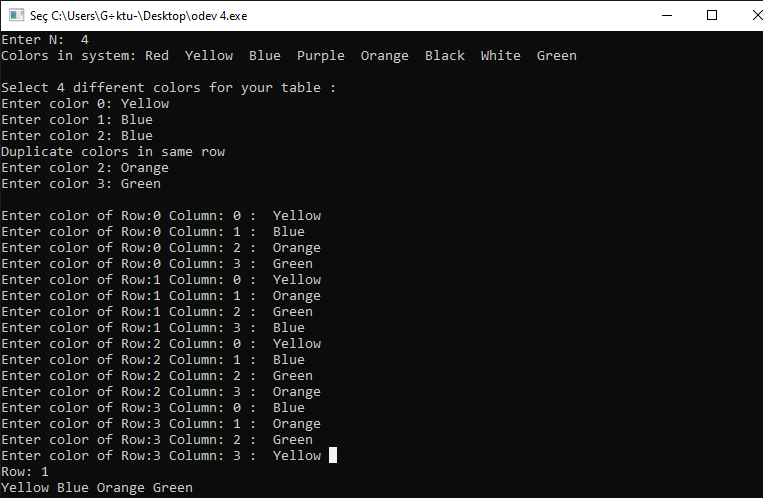

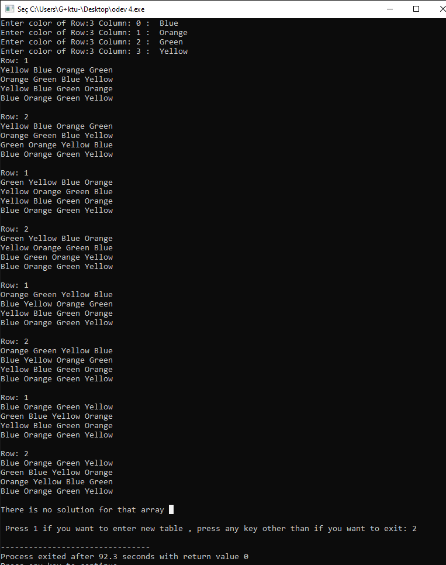

2- 

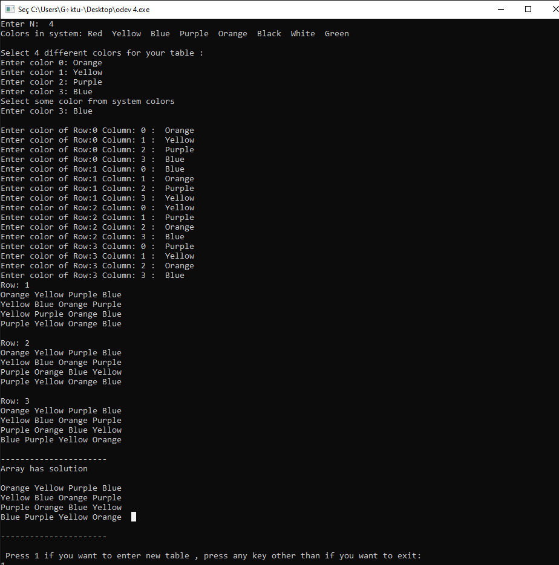

3-

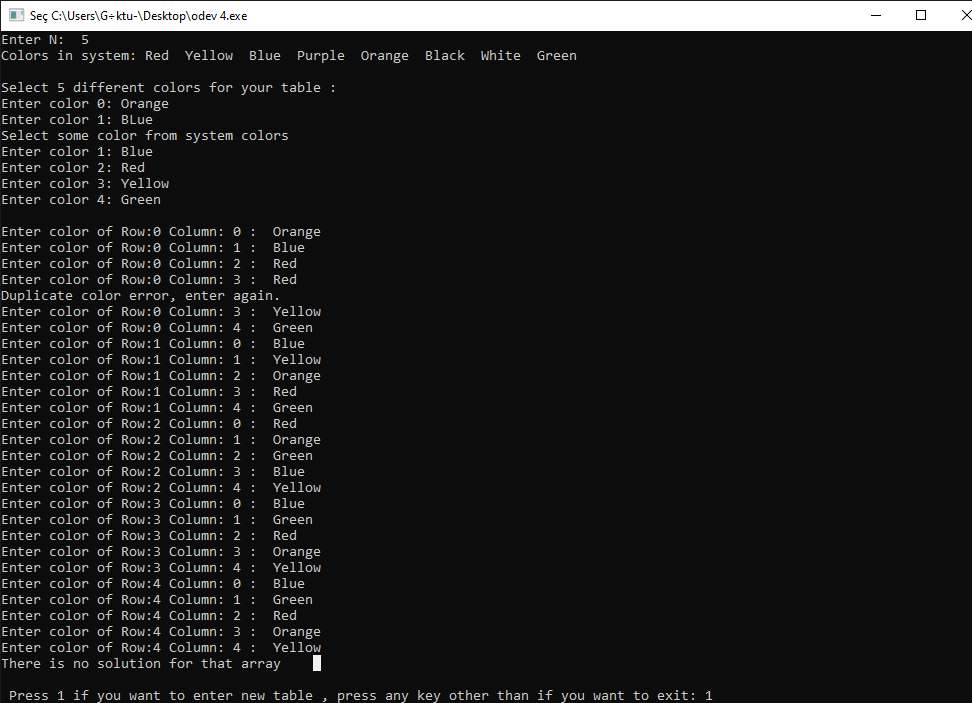

4- 

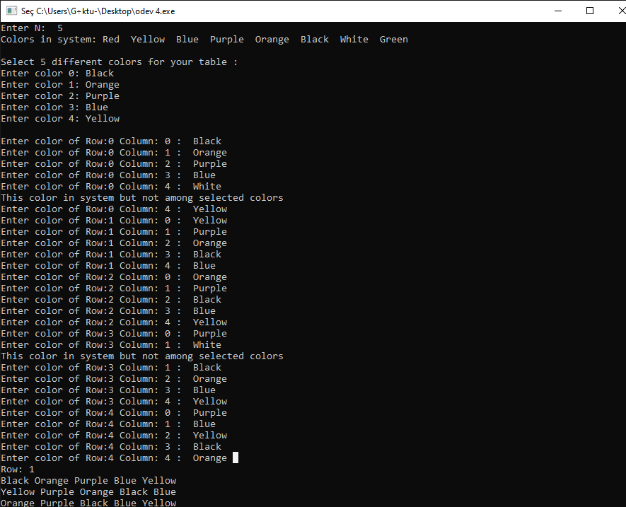

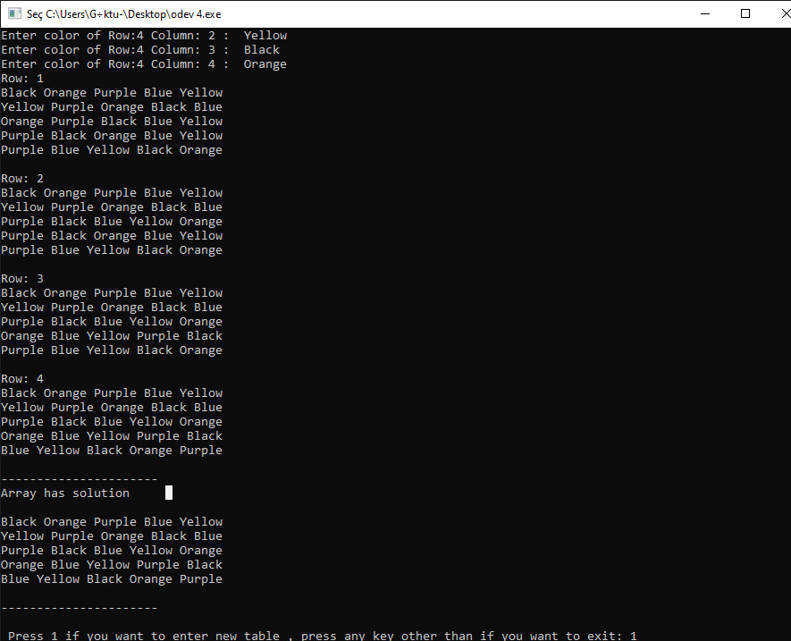

5-

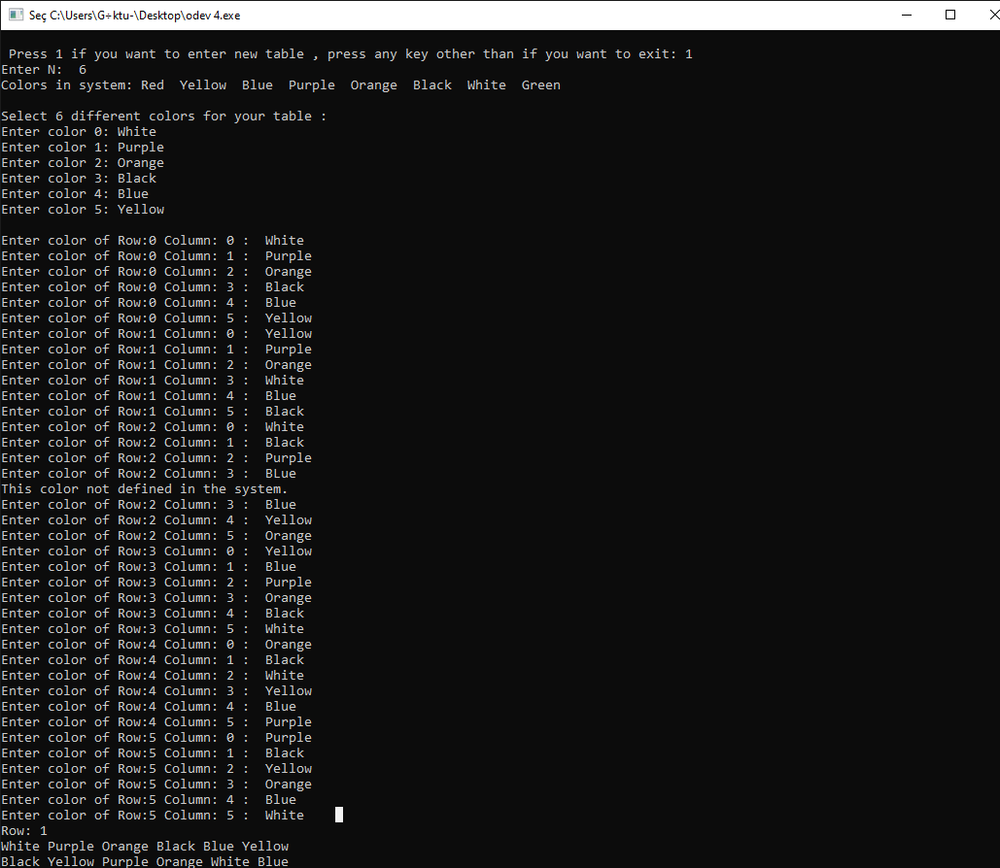

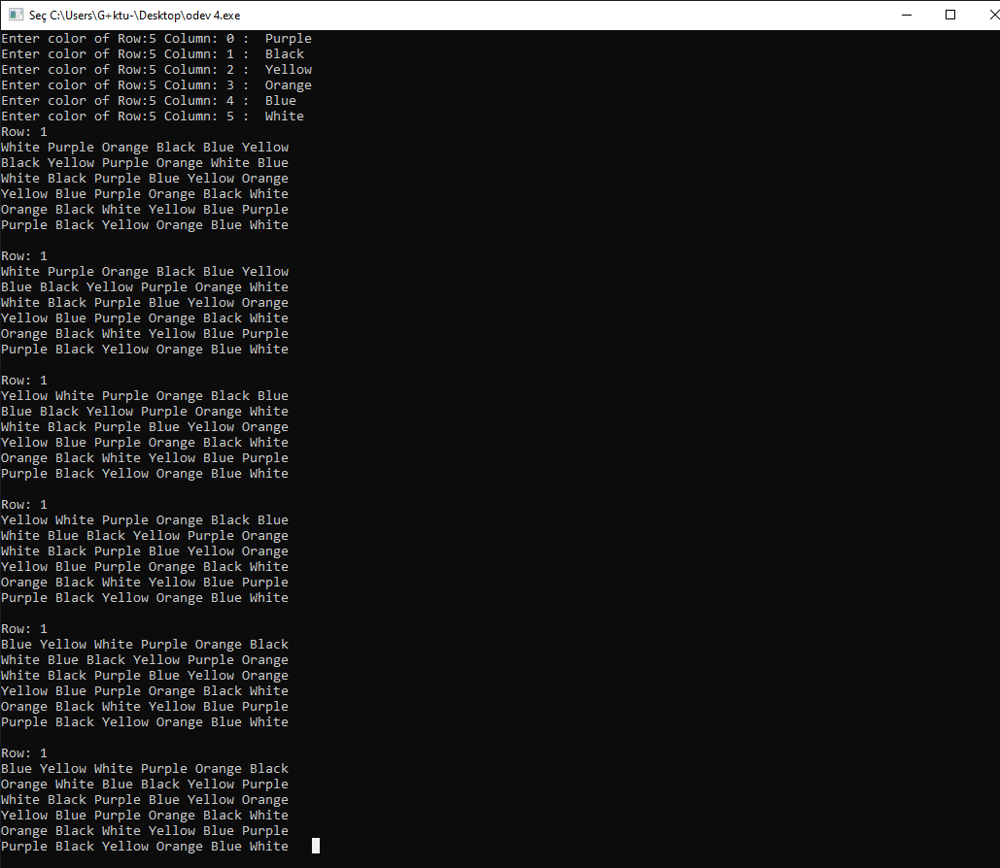

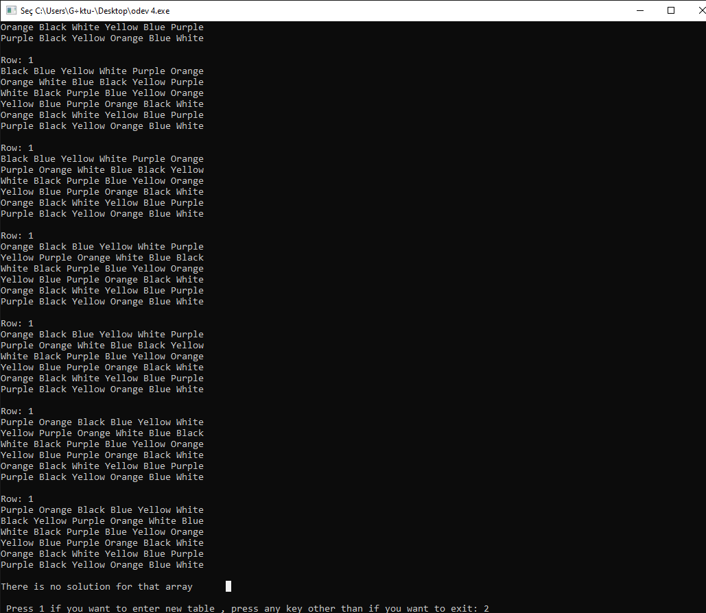

6-

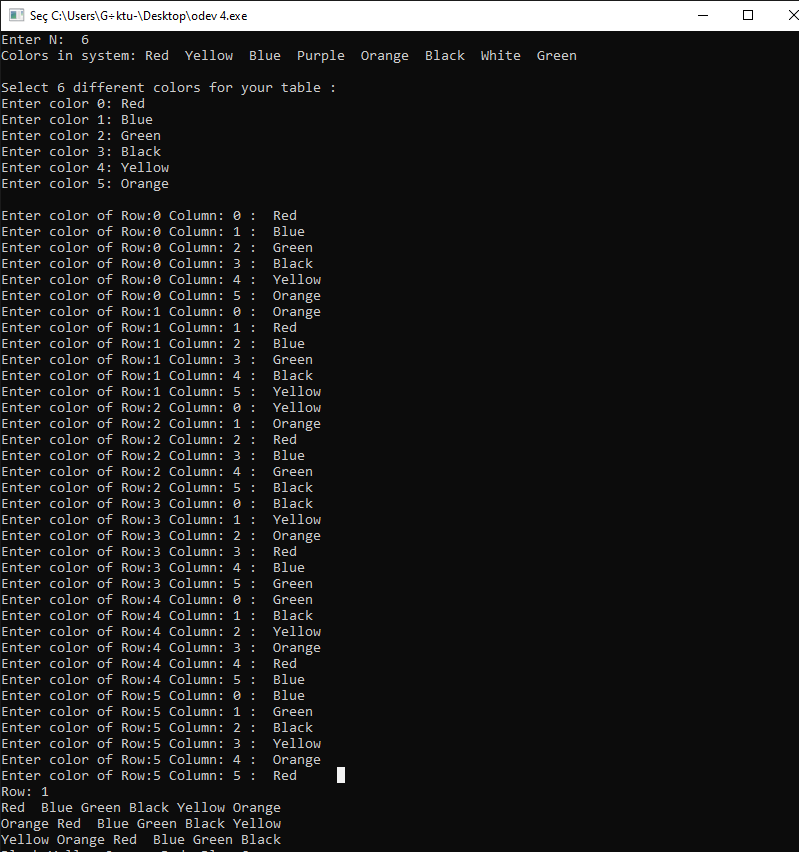

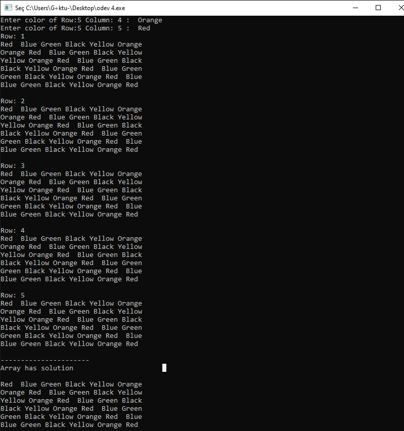

